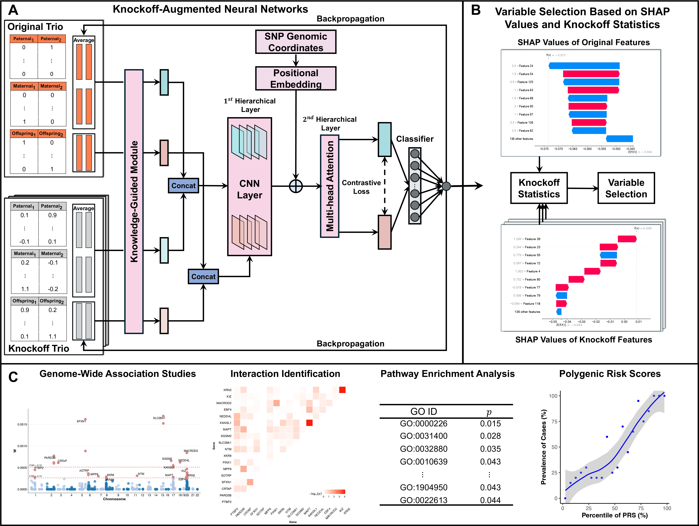

# Knockoff-Augmented Neural Networks for Identifying Risk Variants in Family-Based Association Studies

**KNOT** (**K**nockoff-augmented **N**eural network **o**n **T**rio data) is designed for stabilized variable selection with false discovery rate (FDR) control in family-based genome-wide association studies (GWAS).

This repository provides scripts for simulation data generation, model training, and feature importance computation.



---

## Repository Structure

- `KNOT/model_combine.py`: Defines the DNN architecture with:
  - `PositionalEncoding` for sequence position encoding  
  - `LocallyConnected1D` for non-shared weight convolutions  
  - `DNN` for the full model, including a Siamese encoder and classifier  
- `KNOT/utils.py`: Contains the `Args` class for managing hyperparameters (e.g., learning rate, epochs, latent dimension) and configuration settings.  
- `KNOT/run.py`: Main script to execute experiments, handling data loading, model training, and feature importance computation using SHAP and gradients.  
- `KNOT/callback_prediction_quan_combine.py`: Trainer class for quantitative tasks, implementing MSE loss, contrastive (distance) loss, L1 regularization, and R² validation.  
- `KNOT/callback_prediction_combine.py`: Trainer class for classification tasks, using BCE loss, contrastive (distance) loss, L1 regularization, and ROC-AUC validation.  
- `KNOT/generate_knockoffs.R`: Functions for generating knockoffs.  
- `KNOT/permutation_test.R`: Function for permutation tests based on SHAP interaction values.  
- `KNOT/get_knowledge.R`: Function for calculating FBAT-based prior knowledge.

---

## Installation

1. **Clone the repository**:

   ```bash
   git clone https://github.com/EddieFua/KNOT.git
   cd KNOT

2. **Set Up Environment**:

   ```bash
   python -m venv
   source venv/bin/activate  # On Windows: venv\Scripts\activate
   pip install -r requirements.txt
   ```

   **Required Dependencies**:

   - `torch`
   - `numpy`
   - `pandas`
   - `pyreadr`
   - `shap`
   - `scikit-learn`
   - `tqdm`

## Steps

### **Step 1**: Generate Knockoffs and Format Input Data
Use `generate_knockoffs.R` to create knockoffs.
The file `./example_data/Binary/original.RData` contains simulated genotype data with samples ordered as: dad → mom → offspring in each trio.
```R
source('./KNOT/generate_knockoffs.R')
load("./example_data/Binary/original.RData")

dat1 = knockofftrio_create_knockoff(
  dat = sim$dat,
  pos = sim$pos,
  M = 10,
  hap = TRUE,
  dat.hap = sim$dat.hap,
  xchr = FALSE,
  sex = sim$sex,
  phasing.dad = sim$phasing.dad,
  phasing.mom = sim$phasing.mom
)

save(dat1, file = './example_data/Binary/dat1.RData')

# Extract trios
parent_matrix <- Compute_expected(sim$dat)
index_off <- seq(3, dim(sim$dat)[1], 3)
index_dad <- seq(1, dim(sim$dat)[1] - 2, 3)
index_mom <- seq(2, dim(sim$dat)[1] - 1, 3)

# Create arrays
child_array <- array(dim = c(dim(parent_matrix)[1], dim(sim$dat)[2], max(M.vec) + 1))
child_array[, , 1] <- sim$dat[index_off, ]
for (i in 2:(max(M.vec) + 1)) {
  child_array[, , i] <- dat1[index_off, , i - 1]
}

dad_array <- array(dim = c(dim(parent_matrix)[1], dim(parent_matrix)[2], max(M.vec) + 1))
dad_array[, , 1] <- sim$dat[index_dad, ]
for (i in 2:(max(M.vec) + 1)) {
  dad_array[, , i] <- dat1[index_dad, , i - 1]
}

mom_array <- array(dim = c(dim(parent_matrix)[1], dim(parent_matrix)[2], max(M.vec) + 1))
mom_array[, , 1] <- sim$dat[index_mom, ]
for (i in 2:(max(M.vec) + 1)) {
  mom_array[, , i] <- dat1[index_mom, , i - 1]
}

save(dad_array, file = './example_data/Binary/dad_array.RData')
save(mom_array, file = './example_data/Binary/mom_array.RData')
save(child_array, file = './example_data/Binary/child_array.RData')
```

### **Step 2**: Compute prior knowledge (FBAT weights)
```R
source('./KNOT/get_knowledge.R')
load('./example_data/Binary/dat1.RData')
load('./example_data/Binary/original.RData')

prior <- get_knowledge(dat1, sim, path = './KNOT/example_data/Binary/', quan = FALSE)
# This produces `weight.csv` used by the Python pipeline
```

### **Step 3**: Run KNOT

Use `run.py` to run experiments:
```bash
python run.py --sample_size 3000 --quan False --data_path './example_data/Binary/'
```

#### Arguments:

- `--sample_size`: Number of samples (default: 3000).
- `--quan`: True for quantitative, False for classification (default: False).
- `--data_path`: Directory with data files (e.g., `child_array.RData`, `dad_array.RData`, `mom_array.RData`, `weight.csv`, `y.RData`).

#### Data Format:

- **Genomic Data**: `.RData` files with shape `(num_samples, num_features, num_knockoffs)`.
- **Weights**: `weight.csv` with shape `(num_knockoffs + 1, num_features)`.
- **Labels**: Quantitative tasks use `y.RData` (continuous values); classification tasks generate binary tensors.

#### Outputs:

- `FI_nn_final_gradient.csv`: Gradient-based feature importance.
- `FI_nn_final_shap.csv`: SHAP-based feature importance.

## Model Details

### Training

- **Early Stopping**: Patience of 5 epochs.
- **Loss**:
  - Quantitative: MSE + contrastive loss + L1 regularization.
  - Classification: BCE + contrastive loss + L1 regularization.
- **Hyperparameters**: Configurable via `Args` (e.g., learning rate: 0.0001, epochs: 50, latent_dim: 32).

## Applications

- **GWAS**: Identifies significant features using p-values.
- **Pathway Enrichment**: Maps features to biological pathways.
- **Interaction Identification**: Permutation test based on SHAP interaction value.
- **PRS**: Computes risk scores based on feature effect sizes.

```R
### Example: Interaction Identification
# genotype_dat: matrix with rows as samples and columns as selected variants
# y: phenotype labels
# gene_closer: mapping of each variant to its gene
# N: number of permutations

res = compute_shap_interaction_pvalues(
  genotype_dat,
  y,
  gene_closer,
  N = 100,
  cores = 10,
  seed = 10
)
```

## Contact

For questions, open an issue on GitHub or [email](yinghao.fu@my.cityu.edu.hk), or visit my [personal homepage](https://eddiefua.github.io/).
