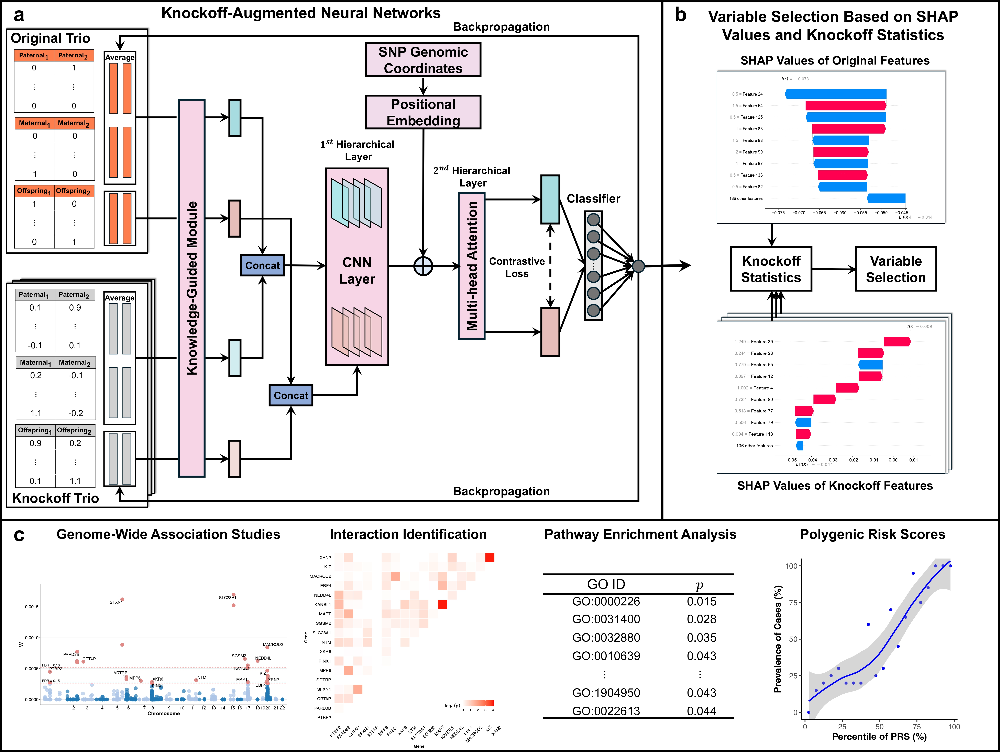

# Knockoff-Augmented Neural Networks for Identifying Risk Variants in Family-Based Association Studies

**KNOT** (**K**nockoff-augmented **N**eural network **o**n **T**rio data) is designed for stabilized variable selection with false discovery rate (FDR) control in family-based genome-wide association studies (GWAS).

This repository provides scripts for simulation data generation, model training, and feature importance computation.



---

## Repository Structure

- `KNOT/model_combine.py`: Defines the DNN architecture, including:
  - `PositionalEncoding` for sequence position encoding  
  - `LocallyConnected1D` for non-shared weight convolutions  
  - `DNN` for the full model, including a Siamese encoder and classifier  
- `KNOT/utils.py`: Contains the `Args` class for managing hyperparameters (e.g., learning rate, epochs, latent dimension) and configuration settings.  
- `KNOT/run.py`: Main script to execute experiments, handling data loading, model training, and feature importance computation using SHAP and gradients.  
- `KNOT/callback_prediction_quan_combine.py`: Trainer class for quantitative tasks, implementing MSE loss, contrastive (distance) loss, L1 regularization, and R² validation.  
- `KNOT/callback_prediction_combine.py`: Trainer class for classification tasks, using BCE loss, contrastive (distance) loss, L1 regularization, and ROC-AUC validation.  
- `KNOT/generate_knockoff.R`: Functions for generating knockoffs.  
- `KNOT/permutation_test.R`: Function for permutation tests based on SHAP interaction values.  
- `KNOT/get_knowledge.R`: Function for calculating FBAT-based prior knowledge.  
- `KNOT/knockoff_filter.R`: Implements q-value computation for multi-knockoff FDR control.

---

## Installation

1. **Clone the repository**:

   ```bash
   git clone https://github.com/EddieFua/KNOT.git
   cd KNOT

2. **Set Up Environment**:

   ```bash
   python -m venv
   source venv/bin/activate  # On Windows: venv\Scripts\activate
   pip install -r requirements.txt
   ```

   **Required Dependencies**:

   - `torch`
   - `numpy`
   - `pandas`
   - `pyreadr`
   - `shap`
   - `scikit-learn`
   - `tqdm`

## Workflow

### **Step 1**: Generate Knockoffs and Format Input Data
Use `generate_knockoffs.R` to create knockoffs.
The file `./example_data/Binary/original.RData` contains simulated genotype data with samples ordered as: dad → mom → offspring in each trio.
```R
source('./KNOT/generate_knockoff.R')
load("./example_data/Binary/original.RData")
M = 10 #num of knockoffs
dat1 = knockofftrio_create_knockoff(
  dat = sim$dat,
  pos = sim$pos,
  M = M,
  dat.hap = sim$dat.hap,
  phasing.dad = sim$phasing.dad,
  phasing.mom = sim$phasing.mom
)

save(dat1, file = './example_data/Binary/dat1.RData')

# Extract trios
parent_matrix <- Compute_expected(sim$dat)
index_off <- seq(3, dim(sim$dat)[1], 3)
index_dad <- seq(1, dim(sim$dat)[1] - 2, 3)
index_mom <- seq(2, dim(sim$dat)[1] - 1, 3)

# Create arrays
child_array <- array(dim = c(dim(parent_matrix)[1], dim(sim$dat)[2], M + 1))
child_array[, , 1] <- sim$dat[index_off, ]
for (i in 2:(max(M) + 1)) {
  child_array[, , i] <- dat1[index_off, , i - 1]
}

dad_array <- array(dim = c(dim(parent_matrix)[1], dim(parent_matrix)[2], max(M) + 1))
dad_array[, , 1] <- sim$dat[index_dad, ]
for (i in 2:(max(M) + 1)) {
  dad_array[, , i] <- dat1[index_dad, , i - 1]
}

mom_array <- array(dim = c(dim(parent_matrix)[1], dim(parent_matrix)[2], max(M) + 1))
mom_array[, , 1] <- sim$dat[index_mom, ]
for (i in 2:(max(M) + 1)) {
  mom_array[, , i] <- dat1[index_mom, , i - 1]
}

save(dad_array, file = './example_data/Binary/dad_array.RData')
save(mom_array, file = './example_data/Binary/mom_array.RData')
save(child_array, file = './example_data/Binary/child_array.RData')
```
#### Arguments:
- `--dat`: 3n × p matrix for trio genotype data, with n trios and p variants (ordered as father → mother → offspring).
- `--pos`: Numeric vector of length p indicating variant positions.
- `--M`: Number of knockoffs. 
- `--dat.hap`: 6n × p haplotype matrix for trios (0/1 coding).
- `--phasing.dad/phasing.mom`: Indicates which haplotype was transmitted (1 or 2); if NULL, automatically inferred.

#### Outputs:
- `dat1`: 3n × p × M array of knockoff trio genotype data.


### **Step 2**: Compute prior knowledge (FBAT weights)
```R
source('./KNOT/get_knowledge.R')
load('./example_data/Binary/dat1.RData')
load('./example_data/Binary/original.RData')

prior <- get_knowledge(dat1, sim$dat, y, path = './example_data/Binary/', quan = FALSE)
```
#### Arguments:
- `--dat1`: Knockoff trio genotype array. 
- `--dat`: Original trio genotype matrix. 
- `--y`: Phenotype vector of length 3n.
- `--path`: Directory to save prior knowledge.
- `--quan`: `TRUE` for quantitative, `FALSE` for binary phenotype.

#### Outputs:
- `prior`: (M+1)*p matrix of prior knowledge, first row corresponds to original variants.

### **Step 3**: Run KNOT

Use `run.py` to run experiments:
```bash
python run.py --sample_size 3000 --quan False --data_path './example_data/Binary/'
```

#### Arguments:

- `--sample_size`: Number of samples.
- `--quan`: `True` for quantitative, `False` for classification.
- `--data_path`: Directory with data files (e.g., `child_array.RData`, `dad_array.RData`, `mom_array.RData`, `weight.csv`, `y.RData`).

#### Data Format:

- **Genomic Data**: `.RData` files with shape `(num_samples, num_features, num_knockoffs)`.
- **Weights**: `weight.csv` with shape `(num_knockoffs + 1, num_features)`.
- **Labels**: Quantitative tasks use `y.RData` (continuous values); classification tasks generate binary tensors.

#### Outputs:

- `FI_nn_final_gradient.csv`: Gradient-based feature importance.
- `FI_nn_final_shap.csv`: SHAP-based feature importance.

### **Step 4**: Identification of Risk Variants
Control FDR with the multi-knockoff procedure. Use `knockoff_filter.R` to compute q-values.
```R
source('./KNOT/knockoff_filter.R')
FIs = read.csv('./example_data/Binary/FI_nn_final_shap.csv', header = F)
target_fdr_level = 0.2
q = MK.q.byStat(FIs, M = 10)
sel_idx = which(q < target_fdr_level)  # indices of selected variants
```
#### Arguments:
- `--FIs`: Feature importance matrix, (M+1)*p.
- `--M`: Number of knockoffs. 

#### Outputs:
- `q`: q-values of variants.
- `sel_idx`: Indices of variants passing FDR threshold.


### **Step 5**: Identification of Interaction (Permutation Test)
Use the q-values from Step 4 (e.g., target FDR = 0.2) to select variants and test interactions with `permutation_test.R`
In the simulation setting, assume one variant corresponds to one gene.

```R
load("./example_data/Binary/original.RData")
load("./example_data/Binary/y.RData")
source('./KNOT/permutation_test.R')
genotype_dat <- sim$dat[, q < 0.2] 
gene_closer <- 1:ncol(genotype_dat)

res <- compute_shap_interaction_pvalues(
  genotype_dat,
  Y,
  gene_closer,
  N = 100,
  seed = 10
)
```
A 3n*p matrix for trio genotype data. 
#### Arguments:
- `--genotype`: 3n*p matrix for selected variants.
- `--Y`: Phenotype vector of length 3n.
- `--gene_closer`:  A vector of length p that annotates each selected variant with its corresponding gene name
- `--N`:  Number of permutations.
- `-- seed`: Random seed.

#### Outputs

- `res`: List of permutation test results, including:
  - `snp_results`: `data.frame` with columns `{snp1, snp2, raw_value, p_value_raw}`  
    Contains pairwise variant interaction results.
  - `gene_results`: `data.frame` with columns `{gene1, gene2, max_raw_value, p_value_raw}`  
    Aggregates interactions at the gene level using the maximum SHAP interaction value for variants mapped to each gene.
  - `null_raw_array`: 3D array `[N × n_features × n_features]` of null SHAP interaction values  
    Stores SHAP interaction values generated under permutation (null) for p-value computation.


## Applications

- **genotype_dat**: Identifies significant features using p-values.
- **Pathway Enrichment**: Maps features to biological pathways.
- **Interaction Identification**: Permutation test based on SHAP interaction value.
- **PRS**: Computes risk scores based on feature effect sizes.


## Contact

For questions, open an issue on GitHub or [email](yinghao.fu@my.cityu.edu.hk), or visit my [personal homepage](https://eddiefua.github.io/).
